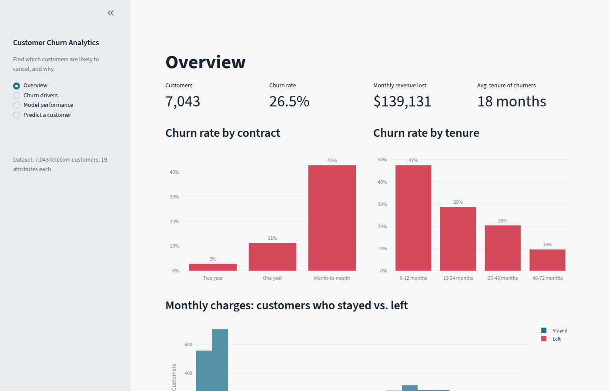
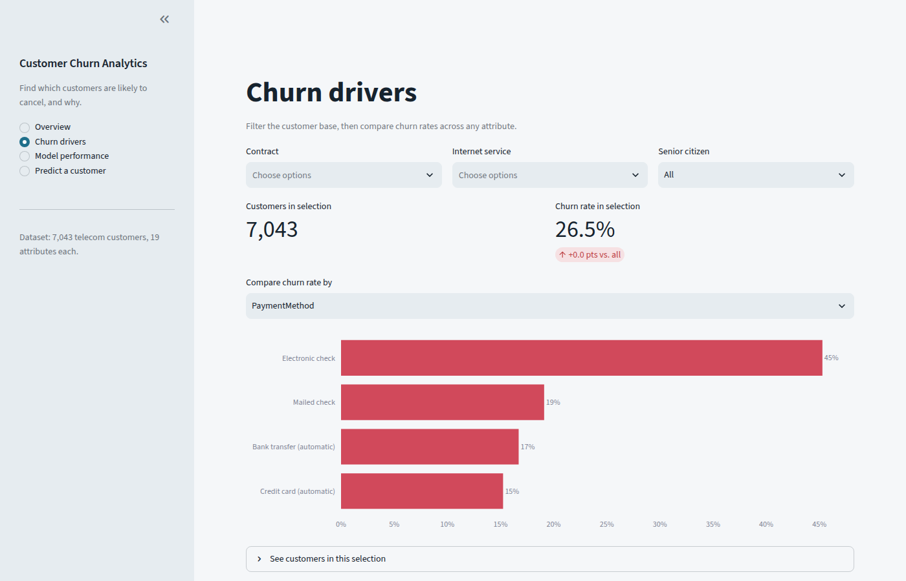
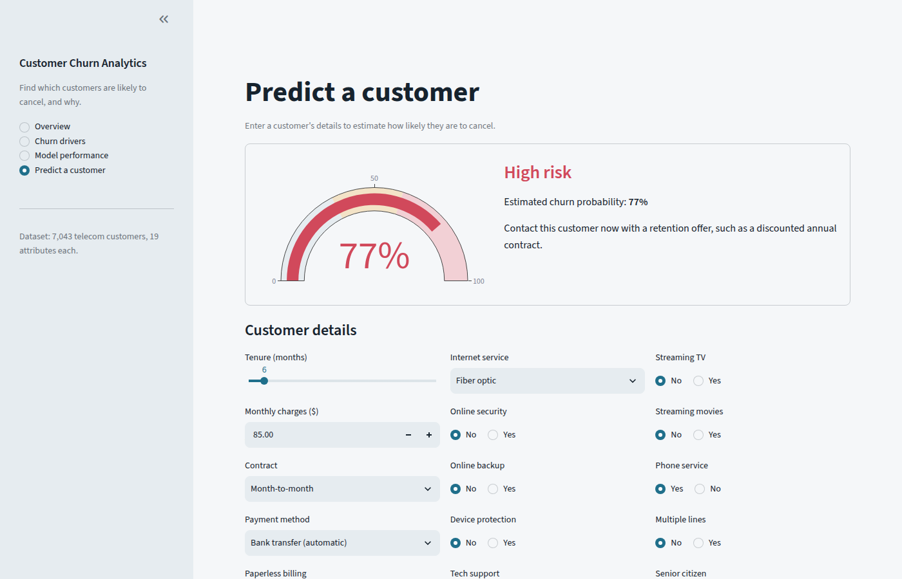
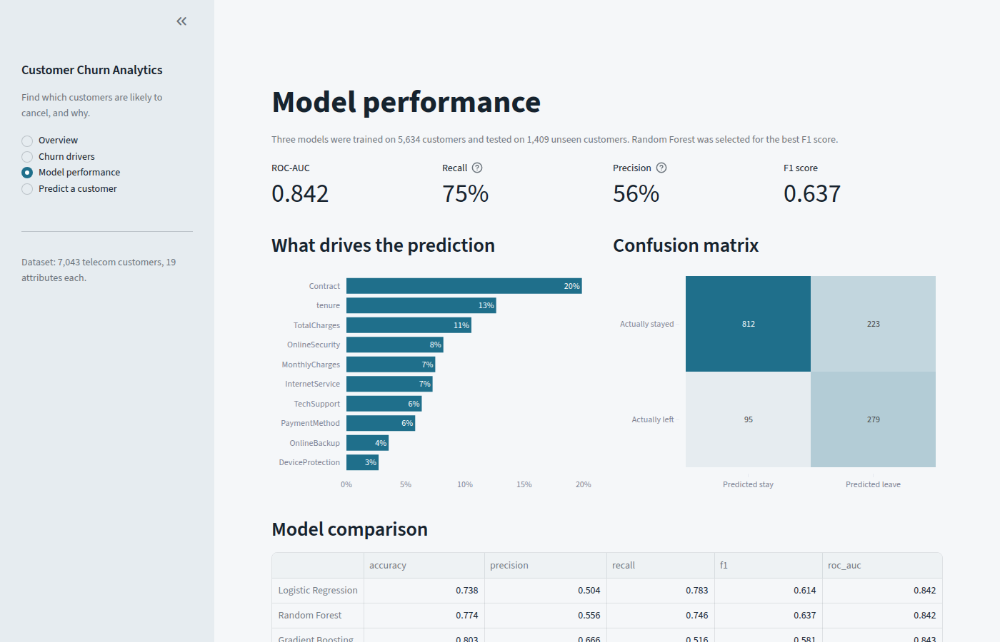

# Customer Churn Analytics & Prediction


An end-to-end machine learning project that helps a subscription business answer two questions: **which customers are about to cancel, and why?**

It analyses 7,043 telecom customers, trains and compares three classification models, and serves the best one in an interactive Streamlit dashboard where you can explore churn drivers and score any customer.



## Key findings

- **26.5%** of customers churned, taking about **$139K in monthly revenue** with them.
- **Contract type is the strongest driver.** Month-to-month customers churn at 43%, versus 11% on one-year and 3% on two-year contracts.
- **The first year is the danger zone.** Customers in their first 12 months churn at 47%.
- Customers paying by **electronic check** and those **without online security or tech support** churn noticeably more.

## Features

- **Overview**: headline KPIs and churn rates by contract, tenure and monthly charges
- **Churn drivers**: filter the customer base and compare churn rates across any attribute
- **Model performance**: metrics, confusion matrix, feature importance and a side-by-side model comparison
- **Predict a customer**: enter a customer's details and get a churn probability, a risk level and a suggested retention action

| Churn drivers | Prediction |
|---|---|
|  |  |

## Modelling

| Step | Details |
|---|---|
| Cleaning | `TotalCharges` converted from text to numbers; blank values (new customers) set to 0 |
| Preprocessing | `StandardScaler` for numeric features, `OneHotEncoder` for categorical ones, in a single scikit-learn `Pipeline` |
| Split | 80/20 stratified train/test split |
| Models compared | Logistic Regression, Random Forest, Gradient Boosting |
| Selection | Best **F1 score**, because a retention team needs to catch churners (recall) without too many false alarms (precision) |

Results on the held-out test set:

| Model | Accuracy | Precision | Recall | F1 | ROC-AUC |
|---|---|---|---|---|---|
| Logistic Regression | 0.738 | 0.504 | 0.783 | 0.614 | 0.842 |
| **Random Forest** (selected) | 0.774 | 0.556 | 0.746 | **0.637** | 0.842 |
| Gradient Boosting | 0.803 | 0.666 | 0.516 | 0.581 | 0.843 |

The selected model catches **3 out of 4** customers who actually leave.



## Getting started

```bash
git clone https://github.com/mohamedazaky/customer-churn-prediction.git
cd customer-churn-prediction
pip install -r requirements.txt
streamlit run app.py
```

The dashboard opens at `http://localhost:8501`. The model trains automatically on the first run (about 20 seconds). On Windows you can also double-click `run_app.bat`.

To retrain manually and print the model comparison:

```bash
python train.py
```

## Project structure

```
customer-churn-prediction/
├── app.py                  # Streamlit dashboard
├── train.py                # Trains, compares and saves the models
├── churn_utils.py          # Data loading, cleaning and feature lists
├── data/telco_churn.csv    # Dataset
├── models/                 # Saved model and metrics (created on first run)
├── screenshots/            # Images used in this README
├── run_app.bat             # Windows one-click launcher
└── requirements.txt
```

## Dataset

[IBM Telco Customer Churn](https://github.com/IBM/telco-customer-churn-on-icp4d): 7,043 customers with demographics, subscribed services, account details and whether they left in the last month.

## License

This project is licensed under the MIT License. See [LICENSE](LICENSE).

## Author

**Mohamed Zaky**, [@mohamedazaky](https://github.com/mohamedazaky)
